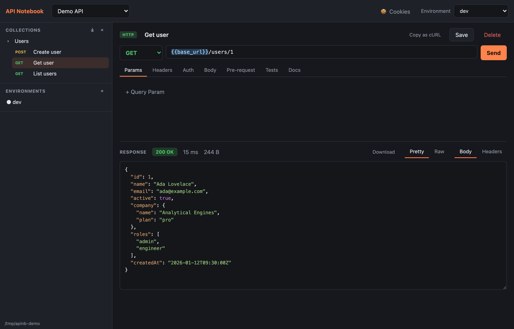

# API Notebook

A local-first, Git-friendly API client that you can run in your browser — like Postman, but every workspace is a
plain folder of JSON and Markdown files you can commit, diff, and share.



- **HTTP & GraphQL requests** with params, headers, body modes (JSON, text,
  form-urlencoded, multipart form-data with file fields, binary file) and
  GraphQL query/variables editors. File bodies are referenced by path and
  read at send time; Content-Type is guessed from the extension.
- **Binary-safe responses** with a Download button; non-text responses
  (images, PDFs, archives) survive intact.
- **Streaming protocols** — WebSocket, Socket.IO, and MCP (Streamable HTTP)
  request types. Connections are made through the local server (so
  `{{variables}}`, headers, auth, and the cookie jar apply), with a live
  message log and reusable saved messages/emits. MCP requests browse a
  server's tools and call them via a form generated from each tool's JSON
  Schema.
- **cURL import/export**: paste a cURL command into a collection to create
  a request, or copy any request as a runnable cURL command with variables
  resolved.
- **Postman import**: bring in a Postman collection or environment export
  (Collection v2.1.0) — folders become collections, requests keep their
  URLs, params, headers, auth and bodies, descriptions become Markdown docs,
  and environment variables import (Postman secrets land in the gitignored
  `.local.json`).
- **Scripts**: Postman-compatible pre-request and post-response (test)
  scripts with a `pm.*` API — set environment variables from a response,
  tweak the outgoing request, and write `pm.test`/`pm.expect` assertions.
  Works at the request, folder, and collection level — collection and folder
  scripts run around every request beneath them.
- **Request management**: hover menu on sidebar items with Rename, Copy,
  Paste (across collections), Duplicate, and Delete; unsaved changes
  highlight the Save button and prompt before navigating away.
- **Cookies**: an automatic per-workspace cookie jar captures `Set-Cookie`
  from responses and attaches matching cookies to later requests (honoring
  domain/path/expiry/secure); a manager lets you view and clear them, and
  scripts can read them via `pm.cookies`.
- **Auth helpers**: Bearer token, Basic auth, API key (header or query).
- **Environments** (workspace-level) with `{{variable}}` interpolation in
  URLs, params, headers, auth fields, and bodies. The active environment is
  stored outside the workspace so it never pollutes your repo.
- **Secret variables**: mark a variable 🔒 and its value is written to a
  gitignored `<env>.local.json` instead of the shared environment file —
  the shared file only declares the name, so teammates see exactly which
  secrets they need to fill in locally.
- **Markdown docs** on every request (stored as a sibling `.md` file, so it
  renders on GitHub) and on every collection.
- **Workspaces** are folders you choose anywhere on disk via the native
  system folder picker (or by typing a path) — collaborate by making a
  workspace a Git repo and pushing it to GitHub. On Linux the picker uses
  `zenity` or `kdialog` if installed.
- **MCP server**: AI agents can connect over MCP to query, build, run, and
  manage workspaces — collections, requests, environments, execution, and
  Postman import — via a Streamable-HTTP endpoint on the same server.
- Requests are executed by the local Node server (no CORS problems), which
  returns status, headers, body, timing, and size.

## Contents

- [Getting started](#getting-started)
- [Workspace layout on disk](#workspace-layout-on-disk)
- [Collaborating via Git](#collaborating-via-git)
- [Importing from Postman](#importing-from-postman)
- [Scripting (pre-request & tests)](#scripting-pre-request--tests)
- [Cookies](#cookies)
- [MCP server (for AI agents)](#mcp-server-for-ai-agents)
- [Keyboard shortcuts](#keyboard-shortcuts)
- [Stack](#stack)
- [Contributing](#contributing)
- [Releases](#releases)
- [License](#license)

## Getting started

```sh
npm install
npm run dev
```

Open http://localhost:5173. The API server runs on http://localhost:3001.

For a production-style single server (serves the built UI and the API from
one port):

```sh
npm run build
npm start          # http://localhost:3001
```

## Workspace layout on disk

```
my-workspace/
├── workspace.json              # { id, name }
├── environments/
│   ├── dev.json                # shared variables + secret variable names
│   └── dev.local.json          # secret values — gitignored, per machine
└── collections/
    └── users-api/
        ├── collection.json     # { name, description }
        └── requests/
            ├── get-user.json   # method, url, params, headers, auth, body…
            └── get-user.md     # the request's Markdown docs
```

App-local state lives in `~/.apinotebook/` (the list of registered workspaces
and each workspace's active environment) — nothing machine-specific is ever
written into the workspace folder.

## Collaborating via Git

```sh
cd my-workspace
git init && git add . && git commit -m "Initial workspace"
gh repo create my-workspace --private --source . --push
```

Teammates clone the repo, then in API Notebook choose
**Open existing folder…** and point it at the clone. Pull to get changes,
commit and push to share yours. Keep credentials in variables marked 🔒
secret: their values live in gitignored `<env>.local.json` files (every
workspace `.gitignore` includes the rule automatically), so the repo shares
the variable names while each teammate supplies their own values. A cloned
workspace shows unfilled secrets with a "missing" warning, and their
`{{tokens}}` highlight red until a local value is set.

## Importing from Postman

Export a collection or environment from Postman (Collection format
**v2.1.0**), then in API Notebook click the **⤓** button in the sidebar's
**Collections** heading. Choose **Import file…** to pick a single `.json`
export, or **Import folder…** to recursively import every collection/environment
export found in a folder at once. The file type is detected automatically, and
everything imports into the **current workspace**, so open or create the
workspace you want first.

What gets mapped:

- **Folders → folders.** Postman folders import as nestable folders inside the
  collection, preserving the original hierarchy. Requests sitting at the
  collection root stay at the root of a collection named after the Postman
  collection.
- **Requests** keep their method, URL (the query string is split into the
  Params editor), headers, and auth (Bearer, Basic, API key). Bodies map
  across raw JSON/text, `x-www-form-urlencoded`, multipart form-data
  (including file fields, by path), binary file, and GraphQL.
- **Descriptions → Markdown docs** on the request.
- **Scripts**: request pre-request/test scripts import into the request's
  **Pre-request** / **Tests** tabs. Collection- and folder-level scripts import
  too and run in the execution chain (collection → folder(s) → request), so they
  still run around every request (see [Scripting](#scripting-pre-request--tests)).
  Scripts may use Postman APIs this app doesn't implement; they import as-is and
  surface any errors at run time.
- **Environments**: each `values` entry becomes a variable. Variables Postman
  marks as `secret` are imported as 🔒 secret — the name goes to the shared
  environment file and the value to the gitignored `<env>.local.json`.

## Scripting (pre-request & tests)

Automate requests with Postman-compatible JavaScript. Each request has a
**Pre-request** tab (runs before sending) and a **Tests** tab (runs after the
response arrives). The most common use is setting environment variables from
a response:

```js
// Tests (post-response)
const data = pm.response.json();
pm.environment.set("bearer_token", data.token);   // later requests use {{bearer_token}}
pm.test("login ok", () => pm.expect(pm.response.code).to.equal(200));
```

### Collection and folder scripts

Scripts don't only live on requests — **collections and folders have the same
Pre-request and Tests tabs** (click the collection or folder in the sidebar to
open its editor). A script set there runs around *every* request underneath
it, which is the place for shared setup like refreshing an auth token or
asserting that no response is a 5xx.

When a request runs, the scripts along its path are chained, outermost first:

```
collection pre-request → folder pre-request(s, outer → inner) → request pre-request
                                → request is sent →
collection tests       → folder tests(s, outer → inner)       → request tests
```

All levels share one run state, so a variable set with `pm.variables.set` in
a collection pre-request script is visible to the folder and request scripts
below it. Collection- and folder-level scripts imported from Postman slot into
this same chain.

### The `pm` API

A pragmatic subset of Postman's:

- `pm.environment.get/set/unset/has/toObject` — **persisted** to the active
  environment. If the variable is 🔒 secret the value goes to the gitignored
  `<env>.local.json`; otherwise to the shared file. (Setting a *non-secret*
  variable writes its value into the committable file — mark secrets as 🔒.)
- `pm.variables.get/set` — a session scope for the current run only (not saved).
- `pm.request` (pre-request) — read/modify `method`, `url`, `headers`
  (`add`/`upsert`/`remove`/`get`) and `body.raw` before the request is sent.
- `pm.response` (tests) — `code`, `status`, `responseTime`, `headers.get()`,
  `.text()`, `.json()`.
- `pm.cookies` — `get(name)`, `has(name)`, `toObject()` for the request's
  domain, read from the workspace cookie jar.
- `pm.test(name, fn)` and a small chai-like `pm.expect` (`.to.equal/eql`,
  `.to.be.a/ok`, `.to.include`, `.to.have.property/status`, `.not`).
- `console.log/info/warn/error` — captured and shown in the response's **Tests**
  tab, alongside test results and the variables a run changed.

Scripts run on the local server in a constrained `node:vm` sandbox (no
`require`, `process`, `fetch` or timers) with a 2-second timeout. This keeps
your own scripts contained on your own machine; it is **not** a hardened
boundary, so review scripts in collections you import from elsewhere before
running them.

## Cookies

Each workspace has an automatic cookie jar, like a browser. When a response
sends `Set-Cookie`, the cookie is stored; on later requests the matching
cookies are attached automatically (respecting domain, path, expiry and the
`Secure` flag). A login request can set a session cookie that subsequent
requests just use — no manual copying.

Click **🍪 Cookies** in the top bar to view the jar grouped by domain and
delete individual cookies or clear them all; a response shows a 🍪 count when
it set any. Scripts can read cookies for the request's domain via
`pm.cookies.get(name)` / `has(name)` / `toObject()`.

Cookies are stored on your machine only (in `~/.apinotebook/`), never inside
the workspace folder, so they are never committed to the repo.

## MCP server (for AI agents)

The server exposes a [Model Context Protocol](https://modelcontextprotocol.io)
endpoint over Streamable HTTP at `http://localhost:3001/mcp`, so AI agents
(Claude Code, Claude Desktop, etc.) can drive your workspaces. It runs on the
same server as the app, so just start it (`npm run dev` or `npm start`) and add
it to your favourite agent. For example:

```sh
claude mcp add --transport http api-notebook http://localhost:3001/mcp
```

Some things you can ask an agent to do once it's connected:

- **Implement a documented API in the app you're working on.** *"Implement
  the `POST /v1/refunds` endpoint described in the Refunds collection of my
  `payments-api` workspace, then run that request against my dev server until
  it passes."* The agent reads the request's URL, params, auth, body, and
  Markdown docs as the spec, writes the endpoint in your codebase, and
  verifies it by executing the saved request — with variables, scripts, and
  the cookie jar applied — iterating until the tests pass.
- **Document a finished API.** After you've built an API, point an agent at
  the source or OpenAPI spec and ask it to *"create a collection in my
  API Notebook workspace with one request per endpoint, each with Markdown
  docs and an example body."* Because a workspace is a plain folder, you can
  review the result as a Git diff and commit it alongside the code.
- **Smoke-test and debug.** *"Run every request in the smoke-tests collection
  against the staging environment and summarize any failures"* — the agent
  gets back status, timing, and `pm.test` outcomes for each run.
- **Migrate and tidy.** *"Import `~/exports/legacy.postman_collection.json`
  into this workspace, then rename the requests to match our conventions and
  move the auth token into a 🔒 secret variable."*

In short, the MCP server lets API Notebook work in both directions: as the
**spec** an agent implements code from, and as the **target** where an agent
documents an API from its source code.

Tools are **multi-workspace** — each takes a `workspaceId` (call
`list_workspaces` first to discover them; create new workspaces from the app UI,
since that needs a folder picker). The tool set covers full management:

- **Query**: `list_workspaces`, `get_workspace_tree`, `get_collection`,
  `get_request`, `get_environment`, `list_cookies`.
- **Build & edit**: `create_collection`, `update_collection`, `create_request`,
  `update_request` (only the fields you pass change; use `{{variable}}` for
  interpolation), `create_environment`, `update_environment`,
  `set_active_environment`, `set_variable`.
- **Run**: `execute_request` — sends a saved request through the proxy with
  variable interpolation, pre-request/test scripts, and the cookie jar, and
  returns the response plus script results and test outcomes.
- **Import**: `import_postman` (collection or environment, by file path).
- **Destructive** (flagged to the agent): `delete_request`, `delete_collection`,
  `clear_cookies`. These are guarded — calling one without `confirm: true`
  returns a summary of exactly what would be deleted and does nothing; the agent
  must surface that and re-call with `confirm: true` once you approve.

The endpoint is unauthenticated, matching the local REST API — it's meant for
`localhost` use only. (cURL-string import isn't an MCP tool; agents create
requests directly via `create_request` / `update_request`.)

## Keyboard shortcuts

- `Cmd/Ctrl+Enter` — send the current request
- `Cmd/Ctrl+S` — save the current request
- `Enter` in the URL bar — send

## Stack

- `server/` — Node + Express + TypeScript. File-based storage, request
  execution proxy with variable interpolation and a 30s timeout.
- `client/` — React + Vite + TypeScript. No state library; talks to the
  server over a small typed API client (`client/src/api.ts`).

## Contributing

Contributions are welcome! See [CONTRIBUTING.md](CONTRIBUTING.md) for how to set
up the project, the [branching model](CONTRIBUTING.md#branching-model), the
PR workflow, and our conventions. `main` is protected and CI must pass before a
pull request merges. By participating you agree to our
[Code of Conduct](CODE_OF_CONDUCT.md).

## Releases

API Notebook is released as source — each version is a Git tag and a
[GitHub Release](https://github.com/mbadaz/api-notebook/releases). The whole app
shares one [SemVer](https://semver.org) version (root, `client`, and `server` in
lockstep). See [CHANGELOG.md](CHANGELOG.md) for what changed and
[RELEASING.md](RELEASING.md) for the release process.

To run a specific release:

```sh
git fetch --tags
git checkout vX.Y.Z
npm install && npm run build
npm start          # http://localhost:3001
```

## License

[MIT](LICENSE) © Tapiwa Muzira
